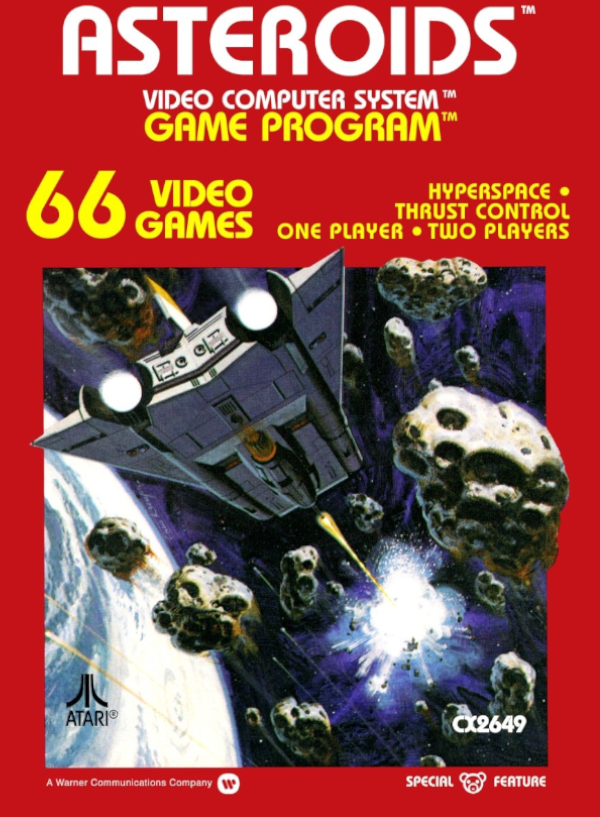

# Asteroids Multiplayer

# Conceito do Jogo
- Uma releitura do clássico Asteroids, focado no modo multijogador e com novas
mecânicas implementadas.
Mecânicas Principais
- Movimentação em tempo real pela grid do mapa com as teclas WASD.
- Disparos orientados pela direção do mouse e clique do mouse button 1.
- Coletáveis que alteram a velocidade de movimento e padrões de disparo.
- Contagem de vida individual, por jogador.
- Asteroides e inimigos que retribuem fogo.

# Estilo Visual e Arte
- Arte simples, inspirada no original, porém com detalhes que darão um feeling
“atual” para o jogo.

# Experiência do Jogador
- Asteroids Multiplayer é um jogo baseado em níveis, contando com o aumento de
dificuldade proporcionado pelo aumento da quantidade de inimigos, limitação de
recursos e diminuição do tempo disponível para “limpar” uma fase.

# Plataformas e Tecnologia
- Voltado para a plataforma de PC Gaming.
